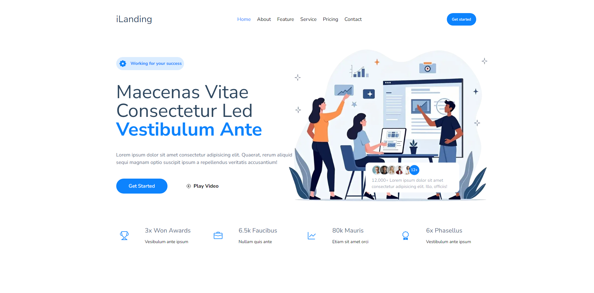

## 🛠️ iLanding

Landing page for businesses, startups, and digital projects with a sleek design and easy usability. using NextJs, tailwindcss and motion-framer

## Features
- **🚀 Fast Performance:** Optimized for speed and smooth loading.
- **📱 Mobile-First Design:** Fully responsive for all screen sizes.
- **🎨 Beautiful Animations:** Smooth interactions powered by Framer Motion.
- **🔒 Secure:** Implemented security best practices for user data protection.
- **💡 Easy Customization:** TailwindCSS enables easy adjustments for any brand or style.

## Technologies Used
- **Frontend:** Next.js, TypeScript, TailwindCSS, Framer Motion  


### 📸 Preview  



### 🛠️ Technologies Used  
- **Frontend:** Next, TypeScript, Tailwindcss  

### 🔧 Installation  
1. Clone the repository:  
   ```sh  
   git clone https://github.com/boypirunporn/ilanding.git  
   ```  
2. Navigate to the project folder:  
   ```sh  
   cd ilanding  
   ```  
3. Install dependencies:  
   ```sh  
   npm install  
   ```  
4. Start the development server:  
   ```sh  
   npm run dev  
   ```  


